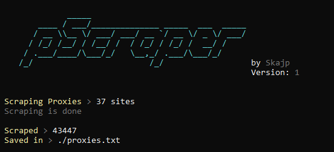

# Proxy Scraper
### by DeadSkajp#5906

- Scrapes 37 sites for proxies
- Saves them in txt file

<br><br>



<br><br><br><br>

# How to Install it?
linux
```
git clone https://github.com/SkajpCZ/ProxyScraper
cd ProxyScraper
python3 ProxyScraper.py
```